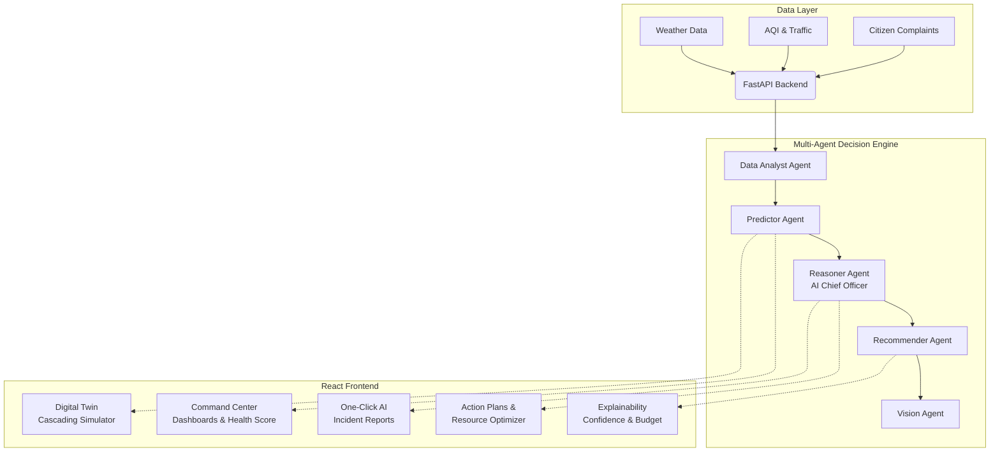
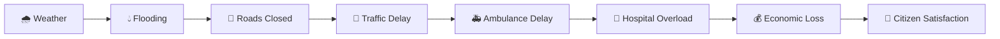

# 🏙️ CityTwin AI — Decision Intelligence Platform

> An advanced AI-powered simulation and decision-making platform for city administrators. It moves beyond standard dashboards to proactive decision intelligence, orchestration, and actionable planning.

## 🎯 What It Does

City administrators face a problem: too many dashboards, too much reactive data, too little time to decide. CityTwin AI solves this by combining real-time data ingestion with a robust **Multi-Agent AI Decision Engine** that acts as an "AI Chief Officer".

Key Differentiators:
- **Proactive, not Reactive** — 24-hour decision timelines forecasting events before they happen.
- **Explainable AI** — Full transparency into AI reasoning, factor weights, confidence scores, and budget impact for every recommendation.
- **Cascading Digital Twin Simulator** — An 8-stage cascading simulator demonstrating how a single event (e.g., rainfall) ripples through city systems (flooding → roads → traffic → ambulances → hospitals → economy → satisfaction).
- **Resource Optimization** — The AI Chief Officer doesn't just chat; it generates structured action plans, allocating pumps, ambulances, and volunteers to specific wards with cost-benefit/ROI calculations.

---

## 🏗 Architecture



---

## 🌟 Key Features

### 1. Multi-Agent Decision Engine & Explainability
- **Confidence Scores & Reasoning**: Every AI prediction provides a 0-100% confidence score and a clear breakdown of the weighted factors (e.g., rainfall 42%, drainage 25%).
- **Budget Impact**: AI recommendations come with calculated `cost_estimates`, `damage_prevented` (savings), and calculated ROI.
- **Agent Pipeline Viz**: Live status of the 5 active AI agents processing the city's data streams.

### 2. Digital Twin: Cascading Simulator & Crisis Mode

- A true digital twin simulating the chain-reaction of events across 8 stages.
- **Live Crisis Mode**: Instantly trigger 5 extreme scenarios (Cyclone Cat-5, Monsoon Worst Case, Heatwave, Earthquake, Pandemic) to see the city's resilience.

### 3. AI Chief Officer & Resource Optimizer
- Chat interface powered by Gemini, upgraded from a standard Q&A bot to an actionable orchestrator.
- Evaluates risk across 12 wards and automatically allocates resources (Pump Stations, Ambulances, Shelters, Volunteers).
- Generates structured, prioritized **Action Plans** detailing urgency, department, and expected financial impact.

### 4. Proactive Decision Timeline
- Generates a dynamic 24-hour forecast timeline. Instead of "Flood detected", it alerts: "Expected flood in 3 hours at Ward 4, followed by gridlock at +6h".

### 5. City Health & Sentiment Analysis
- **City Health Score**: A composite grade (A-F) based on 7 factors (Weather, AQI, Traffic, Healthcare, Satisfaction, Infrastructure, Emergency Readiness).
- **Citizen Sentiment Heatmap**: Analyzes citizen complaints and dynamically generates a sentiment score (😊/😡) for every ward.
- **AI Incident Reports**: One-click generation of polished, executive-ready PDF intelligence reports containing executive summaries, risks, and resource plans.

---

## 🚀 Quick Start

### Backend (FastAPI)
```bash
cd backend
python -m venv venv
.\venv\Scripts\activate   # Windows
pip install -r requirements.txt
cp .env.example .env      # Add your Gemini API key!
uvicorn app.main:app --reload --port 8000
```

### Frontend (React + Vite)
```bash
cd frontend
npm install
npm run dev
```
Access the application at: `http://localhost:5173`

---

## 📱 Core Views

| Page | Description |
|------|-------------|
| **Command Center** | Central dashboard with City Health Score, 24h Decision Timeline, Agent Pipeline, and Explainability Panels. |
| **AI Chief Officer** | Chat interface generating structured action plans and optimal resource allocation strategies. |
| **Digital Twin** | What-if scenarios with the 8-stage cascading simulator and Crisis Mode triggers. |
| **Analytics** | Citizen sentiment heatmap, department performance, and complaint trend analysis. |
| **Reports** | One-click auto-generation of comprehensive AI Incident Reports for stakeholders. |
| **City Map** | Geospatial visualization of wards, hospitals, shelters, and flood zones. |

---

## 🛠 Tech Stack

- **Frontend**: React 19, Vite, Recharts, Leaflet, Framer Motion
- **Backend**: FastAPI, SQLAlchemy, SQLite
- **AI**: Google Gemini 2.5 Flash / Pro (Orchestrating 5 specialized agents)
- **Data Integration**: OpenWeatherMap, AQICN (with robust mock fallbacks)

---

## 👥 Built For
Built for the **Gen AI APAC Hackathon 2026**.
